# ACID Model: Autonomous Causal Intelligence Defense

[](https://www.python.org/downloads/)
[](docs/architecture.md)
[-green.svg)](docs/causal_methodology.md)
[](docs/zero_trust.md)
[](acid/tests)

> **Fundamental Clarification**: The ACID model is **not a website, web app, or frontend dashboard**.
> It is a **fully functional, runnable expert intelligence and multi-agent orchestration model** — a standalone system deployed as a model that can be executed as a CLI tool, an embedded library, an inference server, or a distributed agent mesh.

---

## 1. Overview & Vision

The ACID model operates as a cooperative and adversarial service mesh of specialized AI agents communicating over cryptographic event protocols. Its core architectural differentiator is **causal reasoning** over Pearl's Causal Hierarchy:
- Evaluating **interventions** ($do(X = x)$) rather than mere observational correlation.
- Answering counterfactual "What If?" questions to optimize remediation paths.
- Enforcing strict **compile-time zero-trust guarantees** via the ORGA loop (Observe → Reason → Gate → Act), where unauthorized or out-of-scope actions raise `TypeError` exceptions.
- Serving both **defensive prioritization** and **authorized offensive validation** under explicit Rules of Engagement (RoE).

---

## 2. Five-Layer Architecture

```mermaid
flowchart TB
    subgraph Layer1["Layer 1: Expert Intelligence Core"]
        FS["Foundation-Sec-8B (LLM Reasoning)"]
        SB["SecureBERT (Cybersecurity Embeddings)"]
        FT["Domain Fine-Tuning & Quantization"]
    end

    subgraph Layer2["Layer 2: Multi-Agent Orchestration Mesh"]
        SUP["Supervisor Agent"]
        TRI["Triage Agent"]
        REM["Remediation Agent"]
        VER["Verification Agent"]
        GOV["Governance Agent"]
        CR["Causal Reasoning Agent"]
        RED["Red Team Agent"]
        PUR["Purple Team Agent"]
        AP["Attack Path Agent"]
        C2["C2 Simulation Agent"]
        EMU["Adversary Emulation Agent"]
    end

    subgraph Layer3["Layer 3: Causal Reasoning Engine"]
        CPG["Code Property Graph (CPG)"]
        SCM["Structural Causal Model (SCM)"]
        CF["Counterfactual Engine"]
        GNN["CausalVulGNN (Graph Neural Network)"]
    end

    subgraph Layer4["Layer 4: Zero-Trust Execution Plane (OATS)"]
        ORGA["ORGA Loop (Observe → Reason → Gate → Act)"]
        ID["Agent Identity (Ed25519)"]
        POL["Policy Engine (Deny-by-Default DSL)"]
        ROE["Rules of Engagement (RoE) Enforcer"]
        AUD["Audit Journal (Immutable SHA-256 Hash Chain)"]
    end

    subgraph Layer5["Layer 5: Ingestion & Data Substrate"]
        FEEDS["Real Passive Feeds (NVD, EPSS, KEV, OSV, GHSA, Exploit-DB)"]
        STORE["PostgreSQL Revisions + Redis Streams Event Bus"]
    end

    Layer1 --> Layer2
    Layer2 --> Layer3
    Layer2 --> Layer4
    Layer3 --> Layer4
    Layer4 --> Layer5
```



---

## 3. Quickstart & Installation

### Prerequisites
- Python 3.11+
- Optional: PostgreSQL & Redis (in-process fallbacks included for local execution)

```bash
# Clone the repository
git clone https://github.com/Bhargav-2007/D-VIRS.git
cd D-VIRS/dynamic-vulnerability-intelligence

# Create virtual environment and install dependencies
python -m venv .venv
.\.venv\Scripts\activate
pip install -r requirements.txt
```

---

## 4. CLI Usage

The primary operator interface to the ACID model is the `acid` CLI:

```bash
# Display model status and banner
acid --help

# Start the supervisor agent loop
acid run

# Triage a specific vulnerability with dynamic risk scoring and causal context
acid triage CVE-2021-44228

# Compute hybrid risk score with exact Shapley explanation
acid score CVE-2021-44228

# Ingest real threat intelligence feeds
acid ingest nvd
acid ingest epss
acid ingest kev

# Train the ML ensemble on observed temporal data
acid train --csv data/processed/train.csv --cutoff 2024-01-01

# Run comparative evaluation harness against CVSS/EPSS baselines
acid evaluate --model ml/models/risk.joblib --holdout data/processed/test.csv

# Causal operations: build Code Property Graph and query counterfactuals
acid causal build-graph
acid causal counterfactual --patch CVE-2021-44228

# Verify cryptographic audit journal integrity
acid audit verify
```

---

## 5. Multi-Agent Service Mesh

| Agent ID | Primary Roles | Key Responsibilities |
|---|---|---|
| `supervisor` | Orchestration | Coordinates agent event loop, health, and task dispatching |
| `triage` | Blue / Purple | Dynamic risk scoring (0-100), SHAP attribution, KEV floors |
| `remediation` | Blue Team | Synthesizes patches, workarounds, and compensating controls |
| `verification`| Blue / White | Validates patch efficacy without system regression |
| `governance` | Governance / White | Enforces policy DSL, RoE constraints, and human escalation gates |
| `causal_reasoning` | Blue / Purple | Traverses CPG and computes counterfactual path breakage |
| `red_team` | Red Team | Authorized penetration testing within strict RoE bounds |
| `purple_team` | Purple Team | Correlates red team simulations with blue detection telemetry |
| `attack_path` | Red / Purple | Maps multi-hop lateral movement pathways |
| `c2_simulation` | Red / Purple | Emulates safe command-and-control communication channels |
| `adversary_emulation` | Red Team | Emulates known threat actor TTPs mapped to MITRE ATT&CK |

---

## 6. Zero-Trust & Compile-Time Safety Guarantees

1. **ORGA Execution Order**: Every action must pass through `Observe → Reason → Gate → Act`. Calling `act()` before `gate()` raises an `ORGAPhaseError` (`TypeError`).
2. **Structural Independence**: The Gate phase is evaluated by the deterministic Policy Engine and RoE Engine. LLM text cannot bypass or suppress a denied gate.
3. **Ed25519 Cryptographic Ledger**: All agent actions and events are signed and chained via monotonic SHA-256 hashes. Tampering with any historical entry breaks chain verification.
4. **Strict Scope Validation**: Offensive capabilities are disabled by default (`ACID_OPERATION_MODE=defensive`). When activated, all operations require signed RoE manifests, CIDR boundaries, and sandbox isolation.

---

## 7. Documentation

- [Architecture Specification](docs/architecture.md): Full 5-layer system design.
- [Causal Methodology](docs/causal_methodology.md): Structural Causal Models, CPGs, and counterfactual calculus.
- [Zero-Trust Plane (OATS)](docs/zero_trust.md): Open Agent Trust Stack specification and ORGA formal semantics.
- [Rules of Engagement (RoE) Template](docs/roe_template.md): Boundary definition template for offensive validation.
- [Authorized Offense Guide](docs/authorized_offense_guide.md): Safety controls, sandboxing, and human-in-the-loop escalation.

---

## 8. Verification & Test Suite

Run the full automated test suite verifying zero-trust enforcement, cryptographic audit chaining, causal modeling, dynamic risk scoring, and agent coordination:

```bash
pytest acid/tests -v
```
