# ACID Model: Autonomous Causal Intelligence Defense — Architecture

## 1. Executive Summary

ACID (Autonomous Causal Intelligence Defense) is a standalone, runnable expert intelligence and multi-agent orchestration model for automated cybersecurity defense and authorized offensive evaluation.

Unlike traditional reactive scanners or web applications, ACID operates as a service mesh of specialized AI agents communicating via cryptographic event protocols, with causal reasoning (Pearl's Causal Hierarchy) and compile-time zero-trust enforcement (ORGA loop) as its core differentiators.

```mermaid
flowchart TB
    subgraph L1["Layer 1: Expert Intelligence Core"]
        FS["Foundation-Sec-8B (LLM Reasoning)"]
        SB["SecureBERT (Cybersecurity Embeddings)"]
        FT["Domain Fine-Tuning & Quantization"]
    end

    subgraph L2["Layer 2: Multi-Agent Orchestration Mesh"]
        SUP["Supervisor Agent"]
        TRI["Triage Agent"]
        REM["Remediation Agent"]
        VER["Verification Agent"]
        GOV["Governance Agent"]
        CR["Causal Reasoning Agent"]
        RED["Red Team Agent"]
        PUR["Purple Team Agent"]
        AP["Attack Path Agent"]
        C2["C2 Simulation Agent"]
        EMU["Adversary Emulation Agent"]
    end

    subgraph L3["Layer 3: Causal Reasoning Engine"]
        CPG["Code Property Graph (CPG)"]
        SCM["Structural Causal Model (SCM)"]
        CF["Counterfactual Engine (What-If Analysis)"]
        GNN["CausalVulGNN (Graph Neural Network)"]
    end

    subgraph L4["Layer 4: Zero-Trust Execution Plane (OATS)"]
        ORGA["ORGA Loop (Observe → Reason → Gate → Act)"]
        ID["Agent Identity (Ed25519 Pinning)"]
        POL["Policy Engine (Deny-by-Default DSL)"]
        ROE["Rules of Engagement (RoE) Enforcer"]
        AUD["Audit Journal (Immutable SHA-256 Hash Chain)"]
        TOOL["Offensive Tool Allow-List & Sandboxing"]
    end

    subgraph L5["Layer 5: Ingestion & Data Substrate"]
        NVD["NVD REST API 2.0"]
        EPSS["FIRST.org EPSS"]
        KEV["CISA KEV Catalog"]
        OSV["OSV.dev Package Feeds"]
        GHSA["GitHub Security Advisories"]
        EDB["Exploit-DB & Metasploit PoC Metadata"]
        OTX["AlienVault OTX"]
        ABUSE["Abuse.ch URLhaus / ThreatFox"]
        MISP["MISP Threat Sharing"]
        PG[(PostgreSQL Revision Storage)]
        RD[(Redis Streams Event Bus)]
    end

    L1 --> L2
    L2 --> L3
    L2 --> L4
    L3 --> L4
    L4 --> L5
```

---

## 2. Five-Layer Architecture Overview

┌─────────────────────────────────────────────────────────────────────────────────────────────┐
│                    LAYER 1: EXPERT INTELLIGENCE CORE                                         │
│                                                                                              │
│  Foundation-Sec-8B-Reasoning │ SecureBERT │ Causal Analyst │ Domain-Specific Fine-Tuned LLMs │
│                                                                                              │
│  Capabilities: Threat modeling, vulnerability analysis, attack path reasoning,              │
│               remediation planning, adversarial simulation, CTI correlation                   │
└─────────────────────────────────────────────────────────────────────────────────────────────┘
                                            │
                                            ▼
┌─────────────────────────────────────────────────────────────────────────────────────────────┐
│                    LAYER 2: MULTI-AGENT ORCHESTRATION                                        │
│                                                                                              │
│  ┌─────────────────────────────────────────────────────────────────────────────────────────┐│
│  │                         SUPERVISOR AGENT (Strategic Leader)                              ││
│  │  - Maintains global causal state                                                        ││
│  │  - Routes events to appropriate worker agents                                           ││
│  │  - Enforces governance policies from White Team                                         ││
│  │  - Escalates to humans when confidence is low or risk is high                           ││
│  └─────────────────────────────────────────────────────────────────────────────────────────┘│
│                                            │                                                 │
│         ┌──────────────────┬───────────────┼───────────────┬──────────────────┐             │
│         ▼                  ▼               ▼               ▼                  ▼             │
│  ┌────────────┐    ┌────────────┐   ┌────────────┐   ┌────────────┐   ┌────────────┐        │
│  │  TRIAGE    │    │ REMEDIATION│   │VERIFICATION│   │ GOVERNANCE │   │  CAUSAL    │        │
│  │  AGENT     │    │  AGENT     │   │  AGENT     │   │  AGENT     │   │  REASONING │        │
│  │            │    │            │   │            │   │            │   │  ENGINE    │        │
│  │ Defense +  │    │ Defense +  │   │ Defense +  │   │ Defense +  │   │ GNN on     │        │
│  │ Offense    │    │ Offense    │   │ Offense    │   │ Offense    │   │ CPG +      │        │
│  │ Triage     │    │ Orchestrate│   │ Verify     │   │ Enforce    │   │ Counter-   │        │
│  │            │    │            │   │            │   │            │   │ factual   │        │
│  └────────────┘    └────────────┘   └────────────┘   └────────────┘   └────────────┘        │
│                                                                                              │
│  Offense-Specific: Red Team Agent │ Purple Team Agent │ Attack Path Agent                   │
│  Simulation-Specific: C2 Simulation Agent │ Adversary Emulation Agent                       │
└─────────────────────────────────────────────────────────────────────────────────────────────┘
                                            │
                                            ▼
┌─────────────────────────────────────────────────────────────────────────────────────────────┐
│                    LAYER 3: CAUSAL REASONING ENGINE                                          │
│                                                                                              │
│  ┌─────────────────────────────────────────────────────────────────────────────────────────┐│
│  │  Code Property Graph (CPG) + Structural Causal Model (SCM) + Investigation DAG          ││
│  │  - Nodes: assets, vulnerabilities, CWE, ATT&CK techniques, business services            ││
│  │  - Edges: depends-on, affects, exploits, mitigates, reaches, protects                   ││
│  │  - Counterfactual reasoning: "If we patch X, is path Y broken?"                         ││
│  │  - CausalVulGNN: 19.6% accuracy increase, 28% recall improvement                        ││
│  └─────────────────────────────────────────────────────────────────────────────────────────┘│
└─────────────────────────────────────────────────────────────────────────────────────────────┘
                                            │
                                            ▼
┌─────────────────────────────────────────────────────────────────────────────────────────────┐
│                    LAYER 4: ZERO-TRUST EXECUTION PLANE                                      │
│                                                                                              │
│  ┌─────────────────────────────────────────────────────────────────────────────────────────┐│
│  │  ORGA Reasoning Loop: Observe → Reason → Gate → Act                                     ││
│  │  Policy Enforcement Point (PEP) │ Policy Decision Point (PDP)                           ││
│  │  Cedar/OPA Policy Engine │ SchemaPin/AgentPin Identity Stack                            ││
│  │  Hash-Chained Audit Journals (Ed25519)                                                  ││
│  └─────────────────────────────────────────────────────────────────────────────────────────┘│
└─────────────────────────────────────────────────────────────────────────────────────────────┘
                                            │
                                            ▼
┌─────────────────────────────────────────────────────────────────────────────────────────────┐
│                    LAYER 5: DATA & INTELLIGENCE PLANE                                       │
│                                                                                              │
│  ┌─────────────────────────────────────────────────────────────────────────────────────────┐│
│  │  Real Feeds: NVD, EPSS, CISA KEV, OSV, GHSA, Exploit-DB, OTX, Abuse.ch, MISP            ││
│  │  Feature Store: Offline (PostgreSQL) + Online (Redis) + Versioned Vectors               ││
│  │  Asset Graph: SBOM + CMDB + Cloud APIs + Network Topology                               ││
│  └─────────────────────────────────────────────────────────────────────────────────────────┘│
└─────────────────────────────────────────────────────────────────────────────────────────────┘
