# ACID Model: Autonomous Causal Intelligence Defense — Architecture

## 1. Executive Summary

ACID (Autonomous Causal Intelligence Defense) is a standalone, runnable expert intelligence and multi-agent orchestration model for automated cybersecurity defense and authorized offensive evaluation.

Unlike traditional reactive scanners or web applications, ACID operates as a service mesh of specialized AI agents communicating via cryptographic event protocols, with causal reasoning (Pearl's Causal Hierarchy) and compile-time zero-trust enforcement (ORGA loop) as its core differentiators.

```mermaid
flowchart TB
    subgraph L1["Layer 1: Expert Intelligence Core"]
        FS["Foundation-Sec-8B (LLM Reasoning)"]
        SB["SecureBERT (Cybersecurity Embeddings)"]
        FT["Domain Fine-Tuning & Quantization"]
    end

    subgraph L2["Layer 2: Multi-Agent Orchestration Mesh"]
        SUP["Supervisor Agent"]
        TRI["Triage Agent"]
        REM["Remediation Agent"]
        VER["Verification Agent"]
        GOV["Governance Agent"]
        CR["Causal Reasoning Agent"]
        RED["Red Team Agent"]
        PUR["Purple Team Agent"]
        AP["Attack Path Agent"]
        C2["C2 Simulation Agent"]
        EMU["Adversary Emulation Agent"]
    end

    subgraph L3["Layer 3: Causal Reasoning Engine"]
        CPG["Code Property Graph (CPG)"]
        SCM["Structural Causal Model (SCM)"]
        CF["Counterfactual Engine (What-If Analysis)"]
        GNN["CausalVulGNN (Graph Neural Network)"]
    end

    subgraph L4["Layer 4: Zero-Trust Execution Plane (OATS)"]
        ORGA["ORGA Loop (Observe → Reason → Gate → Act)"]
        ID["Agent Identity (Ed25519 Pinning)"]
        POL["Policy Engine (Deny-by-Default DSL)"]
        ROE["Rules of Engagement (RoE) Enforcer"]
        AUD["Audit Journal (Immutable SHA-256 Hash Chain)"]
        TOOL["Offensive Tool Allow-List & Sandboxing"]
    end

    subgraph L5["Layer 5: Ingestion & Data Substrate"]
        NVD["NVD REST API 2.0"]
        EPSS["FIRST.org EPSS"]
        KEV["CISA KEV Catalog"]
        OSV["OSV.dev Package Feeds"]
        GHSA["GitHub Security Advisories"]
        EDB["Exploit-DB & Metasploit PoC Metadata"]
        PG[(PostgreSQL Revision Storage)]
        RD[(Redis Streams Event Bus)]
    end

    L1 --> L2
    L2 --> L3
    L2 --> L4
    L3 --> L4
    L4 --> L5
```

---

## 2. The Five-Layer Architecture

### Layer 1: Expert Intelligence Core
- **Foundation-Sec-8B**: Domain-adapted transformer for deep cybersecurity reasoning, vulnerability exploitation analysis, and remediation patch synthesis.
- **SecureBERT**: Fine-tuned contextual embedding model for high-fidelity mapping of vulnerability descriptions, CWE categories, and MITRE ATT&CK techniques.
- **Inference Optimization**: 4-bit/8-bit quantization with CPU offloading and fallback rule-based reasoning for resource-constrained environments.

### Layer 2: Multi-Agent Orchestration Mesh
ACID operates 11 specialized autonomous agents:
1. **Supervisor Agent**: Top-level coordinator managing the event loop, agent lifecycles, and cross-team task dispatching.
2. **Triage Agent**: Ingests new vulnerability feeds and computes dynamic risk scores with SHAP attribution.
3. **Remediation Agent**: Synthesizes vendor patches, configuration workarounds, and compensating controls.
4. **Verification Agent**: Validates that proposed fixes resolve the root cause without regressing system functionality.
5. **Governance Agent**: Enforces organizational policy, RoE compliance, and manages human escalation gates.
6. **Causal Reasoning Agent**: Queries the SCM and CPG to evaluate attack paths and blast radius.
7. **Red Team Agent**: Authorized offensive testing within strict boundary constraints.
8. **Purple Team Agent**: Gap analysis correlating red team simulations with blue team detection telemetry.
9. **Attack Path Agent**: Discovers multi-hop lateral movement chains from perimeter to crown-jewel assets.
10. **C2 Simulation Agent**: Safe, simulated command-and-control communication to validate egress filtering.
11. **Adversary Emulation Agent**: Executes realistic threat actor TTPs mapped to MITRE ATT&CK.

### Layer 3: Causal Reasoning Engine
- **Code Property Graph (CPG)**: Merges Abstract Syntax Trees (AST), Control Flow Graphs (CFG), and Data Flow Graphs (DFG) with asset dependency graphs.
- **Structural Causal Model (SCM)**: Distinguishes between pure statistical correlation (e.g. high EPSS) and true causal intervention.
- **Counterfactual Engine**: Answers *L3 What-If* queries: *"If patch P were applied to asset A, what is the probability that attack path Y is broken?"*

### Layer 4: Zero-Trust Execution Plane (OATS)
- **ORGA Loop**: Compile-time enforcement of the *Observe → Reason → Gate → Act* sequence. Skipping the Gate phase is a `TypeError`, structurally preventing unauthorized execution.
- **Cryptographic Identity**: Every agent possesses an Ed25519 keypair and cryptographically signs every action and event.
- **Audit Journal**: Append-only, tamper-evident ledger chained with SHA-256 hashes. Any modification or deletion breaks cryptographic verification.
- **Strict Scope Enforcement**: IP CIDR validation, domain allow-listing, time-window bounding, and mandatory sandbox isolation for all offensive operations.

### Layer 5: Data Substrate & Real-World Feeds
- Only observed real-world data from official sources (NVD, EPSS, KEV, OSV, GHSA, Exploit-DB).
- Complete SHA-256 provenance tracking from raw wire payloads to normalized database revisions.
- Dual-tier storage: PostgreSQL for durable immutable revisions; Redis Streams for low-latency agent event pub/sub.
