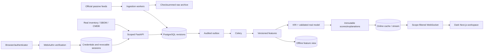

# Architecture

Intelligence is global; asset-related reads use authenticated team/role criteria. Blue writes verify ownership. Purple/White have cross-team read access. Super Admin controls global configuration.

The migration owner and runtime DB role are distinct. Runtime mounts omit the database-owner/bootstrap-admin passwords. Candidate artifacts are separate from approved serving models.

Private API responses are no-store; static frontend assets can be cached. The default Compose network is not a claim of enforced production segmentation or PostgreSQL RLS.
